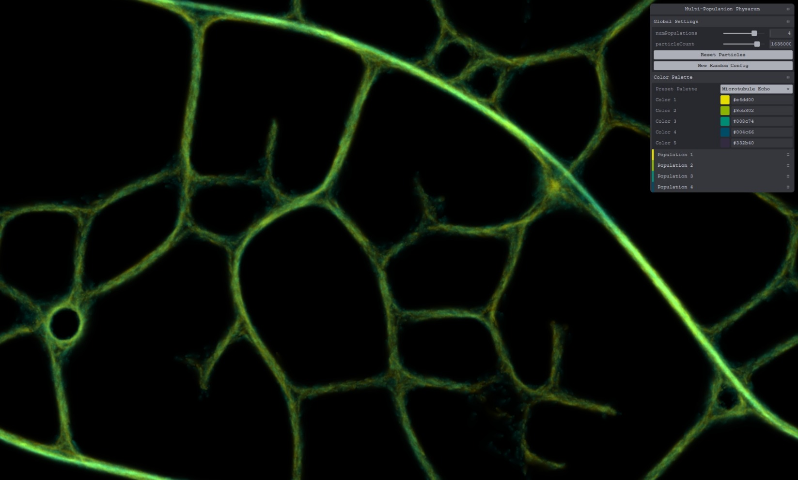

# 🦠 Physarum Simulation

A WebGPU-powered simulation of _Physarum Polycephalum_, better known as slime mold.
Thanks to GPU compute shaders, the simulation can run at 144 FPS with 100 million particles.



<div align="center">
  [Try it live in your browser](https://tobiaslrn.github.io/physarum/)
</div>

## How It Works

Each "slime mold" is particle that follows a few basic steps:

- Move forward
- Look around to sense nearby trails
- Turn toward stronger signals
- Leave a trail behind as it moves

You can also have multiple colonies interacting:

- Some are friendly and drawn to each other
- Others don’t get along and will avoid or repel each other

## Getting Started

You’ll need a browser that supports WebGPU.

To try it locally:

```bash
# 1. Install the project dependencies
npm install

# 2. Start the dev server
npm run dev
```
